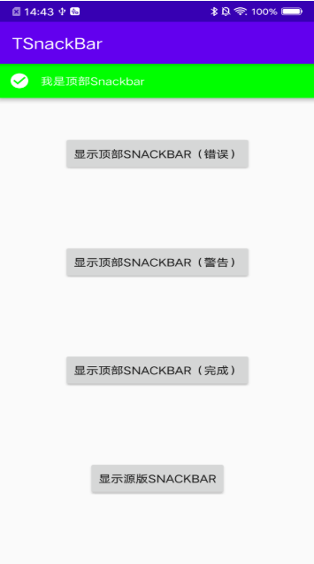

# TSnackBar

[](https://jitpack.io/#PengHaiZhuo/TSnackBar)

顶部Snackbar，源码来自material:1.1.0


### step1:add maven dependency in project's build.gradle

```
allprojects {
    repositories {
        google()
        jcenter()
        maven {url "https://jitpack.io" }
    }
}
```

### step2: add dependency in module's build.gradle
```
 implementation 'com.github.PengHaiZhuo:TSnackBar:Tag'
```

### step3: use this
```
bt.setOnClickListener {
    TopSnackbar.make(it,"错误", TopSnackbar.LENGTH_SHORT,TopSnackbar.STYLE_ERROR).show()
    //TopSnackbar.make(it,"警告", TopSnackbar.LENGTH_SHORT,TopSnackbar.STYLE_WARNING).show()
    //TopSnackbar.make(it,"完成", TopSnackbar.LENGTH_SHORT,TopSnackbar.STYLE_COMPLETE).show()
    }
```

Type|Description
|:--:|:--:|
STYLE_ERROR|红底、白字、带error图标
STYLE_WARNING|黄底、篮字、带warning图标
STYLE_COMPLETE|绿底、白字、带complete图标

### 截图

<p align="center">
	
	<p align="center">
		<em>demo截图</em>
	</p>
</p>
